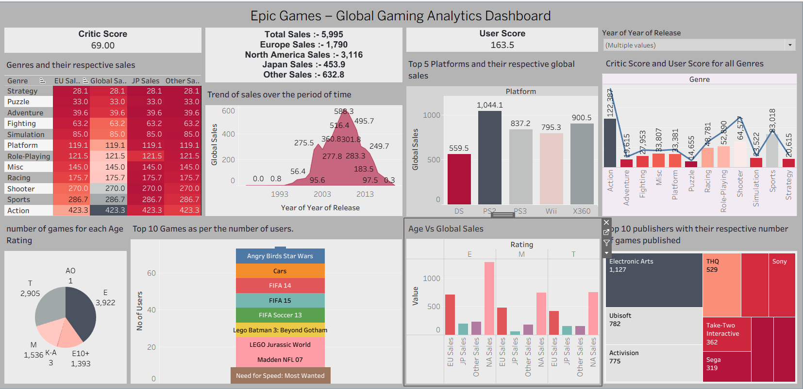

# 🎮 Epic Games: Global Gaming Analytics (Tableau Dashboard)

## 📌 Project Overview
This project presents a comprehensive data visualization and business intelligence analysis of **Epic Games'** global gaming data. Using **Tableau**, the dashboard provides insights into player demographics, regional performance, and revenue distribution across various gaming titles.

## 📊 Key Features & Insights
- **Global Reach:** Analysis of active users and growth across different continents.
- **Revenue Stream:** Deep dive into in-game purchases and regional revenue contributions.
- **Player Engagement:** Identifying peak gaming hours and high-retention titles.
- **Interactive Filters:** Explore data by Genre, Region, and Time Period.

## 🛠️ Tools Used
- **Tableau Desktop** (for Dashboard Creation)
- **Data Source:** Epic Games Global Dataset (Gaming Metrics)

## 📸 Dashboard Preview
> **Note:** Since GitHub doesn't render `.twbx` files, you can view the dashboard screenshot below:

## 📂 Project Structure
- 📄 `Epic Games – Global Gaming Analytics.twbx` : The packaged Tableau workbook.
- 🖼️ `Dashboard_Screenshot.png` : High-resolution image of the final dashboard.
- 📝 `README.md` : Project documentation.

## 🚀 How to View
1. **Option 1:** Download the `.twbx` file and open it in **Tableau Desktop** or **Tableau Reader**.
2. **Option 2:** (If uploaded to Tableau Public) 
